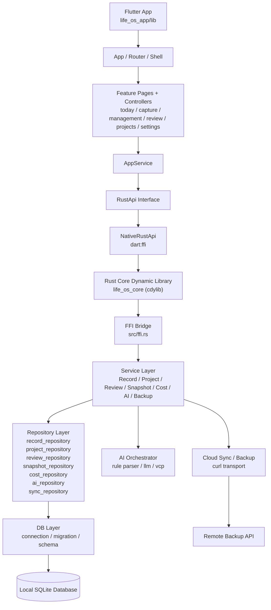

# SkyeOS

> A local-first personal Life OS built with Flutter, Rust, and SQLite to manage records, projects, reviews, costs, and backups through one unified data model.

<p align="left">
  
  
  
  
  
</p>

**English** | [简体中文](README.zh-CN.md)

SkyeOS brings time tracking, income, expenses, learning logs, projects, reviews, AI-assisted capture, and cloud backup into a single local-first data pipeline. This repository currently includes a Flutter app shell in `life_os_app` and a Rust core dynamic library in `life_os_core`, connected through `dart:ffi`.

---

## Table of Contents

- [Overview](#overview)
- [Highlights](#highlights)
- [Architecture](#architecture)
- [Screenshots](#screenshots)
- [Tech Stack](#tech-stack)
- [Requirements](#requirements)
- [Quick Start](#quick-start)
- [Usage](#usage)
- [Configuration](#configuration)
- [Project Structure](#project-structure)
- [Development Notes](#development-notes)
- [Contributing](#contributing)
- [License](#license)
- [Acknowledgements](#acknowledgements)

---

## Overview

SkyeOS is a local-first Life OS for developers and personal productivity builders. Its core goals are:

- ✍️ Capture daily activity in one place, including time, income, expenses, and learning
- 📊 Organize personal operations data through project, snapshot, and review views
- 🤖 Reduce logging friction with AI-based natural language parsing
- 💾 Keep SQLite at the center while enabling local backup and cloud sync extensions

This repository is not a demo-only shell. It already contains a real Flutter page structure, a Rust service layer, repositories, database migrations, and an FFI bridge, along with Rust-side test coverage.

## Highlights

- Today page with status, metrics, goal progress, recent records, and snapshot modules
- Structured capture flows for time, income, expense, and learning records
- AI Capture flow with parsing, draft preview, and commit
- Project management for listing, details, allocations, and linked records
- Review workflows for daily, weekly, monthly, yearly, and custom ranges
- Cost management with monthly baseline, recurring rules, CapEx, and comparisons
- Local backup with restore, cloud upload, remote listing, and download-restore support
- Clean architecture: Flutter UI -> FFI -> Rust Service -> Repository -> SQLite

## Architecture



The main architectural decision is to keep most business logic inside the Rust core while letting Flutter focus on navigation, UI state, and cross-platform shell responsibilities.

## Screenshots

Formal screenshots have not been committed yet. Suggested placeholders:


For public presentation, it is worth adding at least:

- A full Today page overview
- A record capture or AI Capture workflow screenshot

## Tech Stack

- Flutter
- Dart FFI
- Rust `cdylib`
- SQLite
- `rusqlite`
- `serde` / `serde_json`
- `chrono` / `chrono-tz`

## Requirements

Before running locally, prepare the following:

- Rust stable, recommended `1.85+`
- Cargo
- Flutter SDK, recommended `3.22+`
- Dart SDK in the range `>=3.4.0 <4.0.0`
- Xcode / Android Studio / platform toolchains for your target runtime

Notes:

- The Rust core can already be built and tested directly in this repository
- The Flutter UI requires Flutter to be installed locally before it can run

## Quick Start

### 1. Clone the repository

```bash
git clone <your-repo-url>
cd SY
```

### 2. Build and test the Rust core

```bash
cargo test
cargo build
```

### 3. Install Flutter dependencies

```bash
cd life_os_app
flutter pub get
```

### 4. Run the Flutter app

```bash
flutter run
```

If you only want to validate the core logic, running Rust tests is enough. For UI integration, make sure your local Flutter and platform environment are configured correctly.

## Usage

### Validate the Rust core with tests

```bash
cargo test ffi_bridge_can_initialize_write_and_read_today_data -- --nocapture
```

### Current end-to-end data path

```text
Flutter Page
  -> AppService
  -> RustApi
  -> NativeRustApi (dart:ffi)
  -> src/ffi.rs
  -> Rust Service
  -> Repository
  -> SQLite
```

### Example bridged methods

The current bridge already exposes methods such as:

- `init_database`
- `get_today_overview`
- `get_recent_records`
- `create_time_record`
- `create_income_record`
- `create_expense_record`
- `create_learning_record`
- `create_project`
- `list_projects`
- `get_project_detail`
- `get_review_report`
- `parse_ai_input`
- `commit_ai_drafts`

## Configuration

At the moment, the project is primarily local-first. The most important configuration surfaces are:

| Key | Description |
| --- | --- |
| Database path | The local SQLite path passed from Flutter runtime into Rust initialization |
| AI service config | Rust-side `ai_service_configs` and the related settings pages |
| Cloud sync config | Rust-side `cloud_sync_configs` and backup settings pages |
| Timezone | Required by several query and review methods |

If you keep extending the project, it is a good idea to add:

- `.env.example` or platform-specific setup notes
- Dynamic library loading instructions for FFI
- API contract docs for cloud backup endpoints

## Project Structure

```text
.
├── Cargo.toml
├── src/
│   ├── ffi.rs
│   ├── db/
│   ├── repositories/
│   ├── services/
│   ├── ai/
│   └── cloud/
├── tests/
├── migrations/
├── life_os_app/
│   ├── lib/
│   │   ├── app/
│   │   ├── features/
│   │   ├── models/
│   │   ├── services/
│   │   └── shared/
│   └── README.md
├── 数据库结构.md
└── 重构.md
```

## Development Notes

- The Flutter side is already split by feature domains and controllers, not just static placeholders
- The Rust side follows a Service + Repository architecture that is ready for further expansion
- Database migrations, seeded dimensions, and default user initialization are covered by tests
- Even without Flutter installed, Rust core development and validation can continue independently

Recommended next steps:

1. Add packaging and cross-platform loading instructions for the FFI dynamic library
2. Add component and integration tests for Flutter pages
3. Include screenshots, recordings, or GIFs to improve the repository presentation
4. Document deployment and remote sync interface details

## Contributing

Issues and pull requests are welcome.

Suggested workflow:

1. Fork the repository
2. Create a branch: `git checkout -b feat/your-feature`
3. Commit your change: `git commit -m "feat: add your feature"`
4. Push the branch: `git push origin feat/your-feature`
5. Open a pull request

Before submitting, please try to:

- Run `cargo test`
- Keep code style consistent
- Update documentation for new behavior

## License

This repository does not yet include a formal `LICENSE` file.

If you plan to publish it as open source, adding a clear license such as `MIT` or `Apache-2.0` is strongly recommended.

## Acknowledgements

- The Flutter community for cross-platform UI tooling
- The Rust ecosystem for a reliable core runtime
- SQLite for a lightweight and stable local-first data layer
- Everyone exploring personal systems, quantified self tooling, and AI-assisted capture workflows
