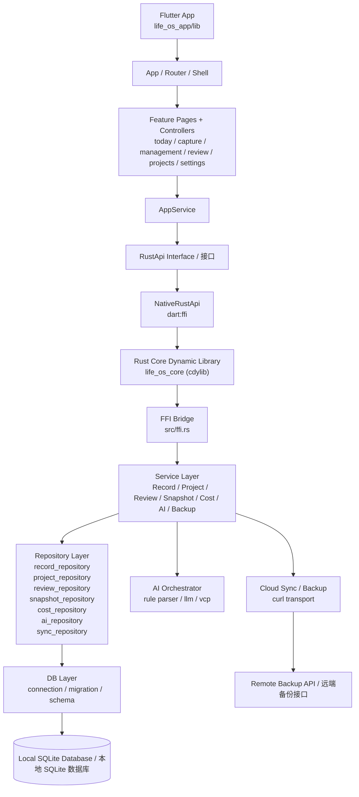

# SkyeOS

> Local-first Life OS built with Flutter, Rust, and SQLite.  
> 基于 Flutter、Rust 与 SQLite 的本地优先个人 Life OS。

<p align="left">
  
  
  
  
  
</p>

## Language

- [English](README.en.md)
- [简体中文](README.zh-CN.md)

## Overview

SkyeOS unifies daily capture, projects, reviews, AI-assisted parsing, and backup workflows into one local-first data pipeline.

SkyeOS 将日常记录、项目管理、复盘、AI 辅助解析与备份能力整合到一条本地优先的数据链路中。

## Repository Layout

- `life_os_app`: Flutter application shell
- `src`: Rust core library
- `tests`: Rust integration and FFI tests
- `migrations`: database migrations

## Architecture



## Quick Start

```bash
cargo test
cd life_os_app
flutter pub get
flutter run
```

For full documentation, use the language-specific files above.  
完整文档请查看上方的中英文版本。
