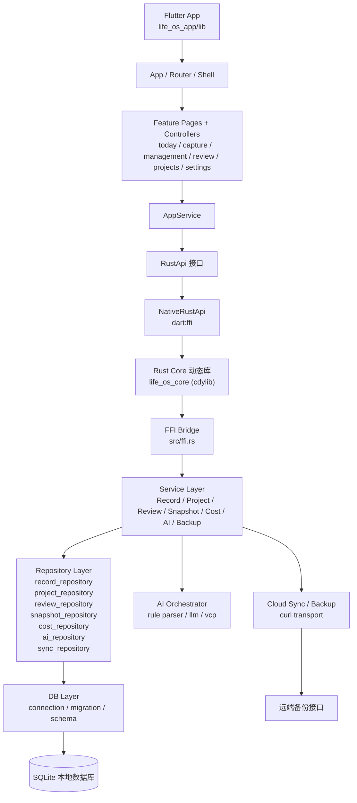

# SkyeOS

> 一个基于 Flutter + Rust + SQLite 的本地优先个人 Life OS，用统一的数据模型管理记录、项目、复盘、成本与备份。

<p align="left">
  
  
  
  
  
</p>

[English](README.en.md) | **简体中文**

SkyeOS 旨在把“时间、收入、支出、学习、项目、复盘、AI 辅助、云端备份”收敛到同一套本地数据链路中。当前仓库包含一个 Flutter 应用壳层 `life_os_app`，以及一个通过 `dart:ffi` 连接的 Rust 核心动态库 `life_os_core`。

---

## 目录

- [项目简介](#项目简介)
- [功能亮点](#功能亮点)
- [系统架构](#系统架构)
- [演示截图](#演示截图)
- [技术栈](#技术栈)
- [安装要求](#安装要求)
- [快速开始](#快速开始)
- [使用示例](#使用示例)
- [配置说明](#配置说明)
- [项目结构](#项目结构)
- [开发说明](#开发说明)
- [贡献指南](#贡献指南)
- [许可证](#许可证)
- [致谢](#致谢)

---

## 项目简介

这是一个面向开发者与个人效率实践者的本地优先 Life OS 项目，核心目标是：

- ✍️ 统一采集日常记录，包括时间、收入、支出、学习等多种数据
- 📊 用项目、快照、复盘视角组织个人运营数据
- 🤖 通过 AI 解析自然语言输入，降低记录成本
- 💾 以 SQLite 为核心，支持本地备份与云端同步扩展

当前仓库更偏“重构中的真实工程骨架”，不是演示型模板。Flutter 页面结构、Rust 服务层、仓储层、数据库迁移与 FFI 桥接都已落地，并带有 Rust 侧测试。

## 功能亮点

- 今日页：聚合今日状态、核心指标、目标进度、最近记录与快照信息
- 记录采集：支持时间、收入、支出、学习等结构化录入
- AI Capture：支持自然语言解析与草稿确认后提交
- 项目管理：支持项目列表、详情、分配与关联记录
- 复盘体系：支持日 / 周 / 月 / 年 / 区间复盘
- 成本管理：包含月度基线、周期成本、CapEx 与对比分析
- 本地备份：支持备份、恢复、上传云端、远端列表与下载恢复
- 清晰分层：Flutter UI -> FFI -> Rust Service -> Repository -> SQLite

## 系统架构



这套架构的重点是把业务逻辑尽量收敛在 Rust Core 中，让 Flutter 主要承担页面组织、交互状态和跨平台壳层职责，方便后续继续扩展桌面端或移动端。

## 演示截图

当前仓库尚未提交正式截图，建议后续补充以下内容：


如果你准备公开展示项目，推荐至少补两张图：

- 首页 / 今日页整体视图
- 记录录入或 AI Capture 流程图

## 技术栈

- Flutter
- Dart FFI
- Rust `cdylib`
- SQLite
- `rusqlite`
- `serde` / `serde_json`
- `chrono` / `chrono-tz`

## 安装要求

在本地运行前，请准备以下环境：

- Rust stable，建议 `1.85+`
- Cargo
- Flutter SDK，建议 `3.22+`
- Dart SDK，满足 `>=3.4.0 <4.0.0`
- Xcode / Android Studio / 对应平台工具链（按你的运行平台准备）

说明：

- Rust 核心库可在当前仓库直接构建和测试
- Flutter UI 需要本机已安装 Flutter 才能运行

## 快速开始

### 1. 克隆仓库

```bash
git clone <your-repo-url>
cd SY
```

### 2. 构建并测试 Rust Core

```bash
cargo test
cargo build
```

### 3. 安装 Flutter 依赖

```bash
cd life_os_app
flutter pub get
```

### 4. 运行 Flutter 应用

```bash
flutter run
```

如果你只想先验证核心逻辑，可以只执行 Rust 侧测试；如果你要联调 UI，请确保本地已正确配置 Flutter 与目标平台环境。

## 使用示例

### Rust Core 测试验证

```bash
cargo test ffi_bridge_can_initialize_write_and_read_today_data -- --nocapture
```

### Flutter 侧调用链路

项目当前的真实数据路径如下：

```text
Flutter Page
  -> AppService
  -> RustApi
  -> NativeRustApi (dart:ffi)
  -> src/ffi.rs
  -> Rust Service
  -> Repository
  -> SQLite
```

### 典型能力示例

当前已桥接的部分方法包括：

- `init_database`
- `get_today_overview`
- `get_recent_records`
- `create_time_record`
- `create_income_record`
- `create_expense_record`
- `create_learning_record`
- `create_project`
- `list_projects`
- `get_project_detail`
- `get_review_report`
- `parse_ai_input`
- `commit_ai_drafts`

## 配置说明

当前项目偏本地运行，核心配置主要体现在以下几个方面：

| 配置项 | 说明 |
| --- | --- |
| 数据库路径 | Flutter `AppRuntime` / Rust 初始化时传入的本地 SQLite 路径 |
| AI 服务配置 | Rust `ai_service_configs` 与对应页面配置 |
| 云同步配置 | Rust `cloud_sync_configs` 与备份页面配置 |
| 时区参数 | 多个查询与复盘接口依赖 `timezone` |

如果你准备继续完善项目，建议补充：

- `.env.example` 或平台配置说明
- FFI 动态库加载说明
- 云端备份接口契约文档

## 项目结构

```text
.
├── Cargo.toml
├── src/
│   ├── ffi.rs
│   ├── db/
│   ├── repositories/
│   ├── services/
│   ├── ai/
│   └── cloud/
├── tests/
├── migrations/
├── life_os_app/
│   ├── lib/
│   │   ├── app/
│   │   ├── features/
│   │   ├── models/
│   │   ├── services/
│   │   └── shared/
│   └── README.md
├── 数据库结构.md
└── 重构.md
```

## 开发说明

- Flutter 侧已经按功能域拆分页面与控制器，不是静态占位页面
- Rust 侧采用 Service + Repository 分层，便于后续继续扩展业务逻辑
- 数据库迁移、默认维度数据与默认用户初始化已经在测试中覆盖
- 当前环境若未安装 Flutter，仍可先完成 Rust Core 开发与验证

建议的后续工作：

1. 完善 FFI 动态库打包与跨平台加载说明
2. 为 Flutter 页面补齐组件测试与集成测试
3. 增加截图、录屏或 GIF，提升 README 展示效果
4. 补充部署方式与云端同步接口文档

## 贡献指南

欢迎提交 Issue 与 Pull Request，一起把这套本地优先 Life OS 打磨完整。

建议贡献流程：

1. Fork 本仓库
2. 新建分支：`git checkout -b feat/your-feature`
3. 提交代码：`git commit -m "feat: add your feature"`
4. 推送分支：`git push origin feat/your-feature`
5. 发起 Pull Request

提交前建议至少完成：

- 运行 `cargo test`
- 保持代码风格一致
- 为新增功能补充必要文档

## 许可证

当前仓库尚未附带正式 `LICENSE` 文件。

如果你计划公开开源，推荐补充一个明确许可证，例如 `MIT` 或 `Apache-2.0`，以方便他人合法使用、修改与分发。

## 致谢

- Flutter 社区，提供跨平台 UI 能力
- Rust 生态，提供可靠的核心业务承载能力
- SQLite，提供轻量稳定的本地优先数据基础
- 所有围绕“个人系统、量化自我、AI 辅助记录”持续探索的开发者与实践者
